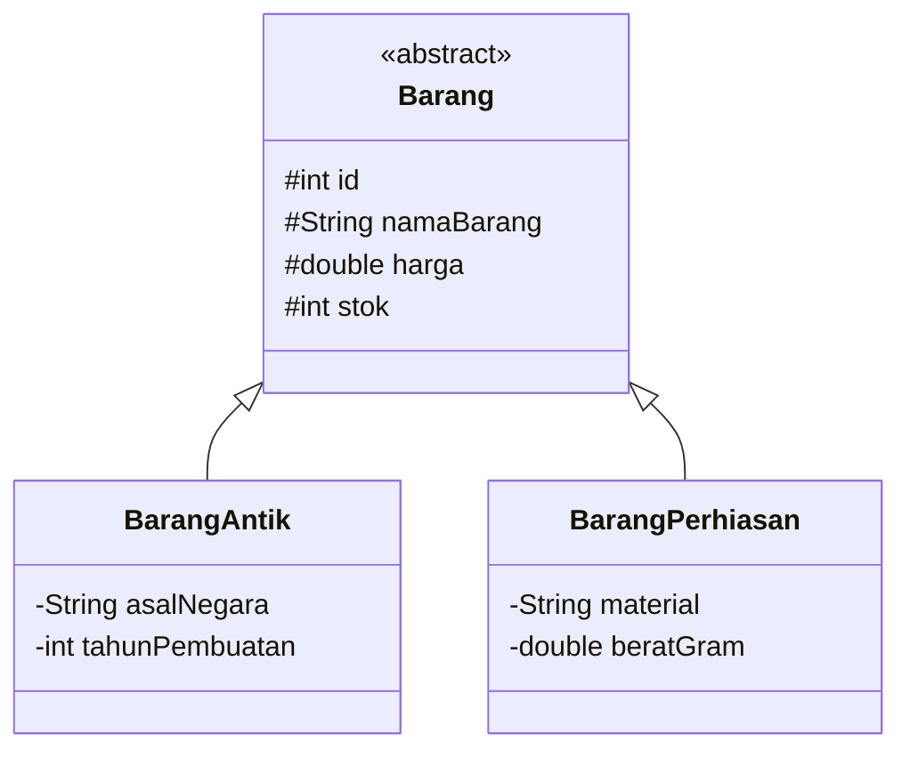

# Dokumentasi Program Mini Project 3 PBO

## Sistem Manajemen Inventaris Toko Barang Antik (Monarch Antiqu'e)

---

### Informasi Mahasiswa

* **Nama** : Mikhel Febian
* **NIM** : 2509116056
* **Kelas** : B
* **Angkatan** : 2025
* **Mata Kuliah** : Pemrograman Berorientasi Objek
* **Tema Program** : Sistem Manajemen Inventaris Barang Antik
* **Nama Sistem** : Monarch Antiqu'e System

---

## 1. Deskripsi Singkat Program

**Monarch Antiqu'e System** merupakan aplikasi manajemen inventaris barang antik berbasis **Command Line Interface (CLI)** yang dikembangkan menggunakan bahasa pemrograman Java.

Program digunakan untuk mengelola data barang antik dan perhiasan melalui operasi **Create, Read, Update, dan Delete (CRUD)**. Pengguna dapat menambahkan, menampilkan, mencari, memperbarui, dan menghapus data barang.

Pada Mini Project 3, program dikembangkan dengan menerapkan konsep Pemrograman Berorientasi Objek berupa **Encapsulation, Inheritance, Polymorphism, Abstraction**, serta struktur proyek **Model-View-Controller (MVC)**.

Sebagai nilai tambah, program juga menerapkan **Interface** melalui `Authenticable`.

---

## 2. Spesifikasi Program

* **Bahasa Pemrograman** : Java
* **JDK** : JDK 17+
* **IDE** : Apache NetBeans
* **Struktur Data** : `ArrayList`
* **Arsitektur** : Model-View-Controller (MVC)
* **Antarmuka** : Command Line Interface (CLI)

---

## 3. Struktur Package

Struktur package program adalah sebagai berikut:

```text
com.mycompany.tokoantik
├── controller/
│   └── BarangController.java
│
├── model/
│   ├── Authenticable.java
│   ├── Barang.java
│   ├── BarangAntik.java
│   └── BarangPerhiasan.java
│
├── util/
│   └── Validator.java
│
├── view/
│   └── MainView.java
│
└── Main.java
```

### Fungsi setiap package

| Package      | Fungsi                                               |
| ------------ | ---------------------------------------------------- |
| `model`      | Menyimpan class dan struktur data utama program      |
| `controller` | Menangani logika pengelolaan dan operasi CRUD data   |
| `view`       | Menangani tampilan CLI dan interaksi dengan pengguna |
| `util`       | Menyediakan fungsi validasi input                    |
| `Main`       | Menjadi entry point untuk menjalankan program        |

---

## 4. Alur Program

Saat program dijalankan, `Main` membuat objek `MainView`, kemudian menjalankan method `start()`.

```text
Main
  ↓
MainView
  ↓
BarangController
  ↓
ArrayList<Barang>
  ↓
Menu Utama
  ├── 1. Tambah Barang
  ├── 2. Tampilkan Semua Barang
  ├── 3. Cari Barang
  ├── 4. Update Barang
  ├── 5. Hapus Barang
  └── 6. Keluar
```

### 4.1 Tambah Barang

Pengguna memilih jenis barang:

1. Barang Antik
2. Barang Perhiasan

Program kemudian meminta atribut umum dan atribut khusus sesuai jenis barang. Object yang dibuat dimasukkan ke dalam `ArrayList<Barang>` melalui `BarangController`.

### 4.2 Tampilkan Semua Barang

Program mengambil seluruh object dari `ArrayList<Barang>` dan menampilkannya dalam bentuk tabel.

### 4.3 Cari Barang

Pencarian dapat dilakukan berdasarkan:

* ID barang
* Nama atau keyword

Program menggunakan method `cariBarang()` dengan parameter berbeda untuk kedua jenis pencarian tersebut.

### 4.4 Update Barang

Pengguna memasukkan ID barang yang ingin diperbarui. Data umum dan data khusus barang kemudian dapat diperbarui menggunakan setter.

### 4.5 Hapus Barang

Pengguna memasukkan ID barang kemudian memberikan konfirmasi sebelum object dihapus dari `ArrayList`.

### 4.6 Keluar

Program menghentikan perulangan menu dan mengakhiri program.

---

# 5. Penerapan Encapsulation

Encapsulation diterapkan dengan membatasi akses langsung terhadap atribut object dan menyediakan method untuk mengakses serta mengubah data.

Contohnya pada class `Barang`:

```java
protected String namaBarang;
protected double harga;
protected int stok;
```

Akses terhadap data dilakukan melalui getter dan setter, contohnya:

```java
public String getNamaBarang() {
    return namaBarang;
}

public void setNamaBarang(String namaBarang) {
    if (namaBarang == null || namaBarang.trim().isEmpty()) {
        throw new IllegalArgumentException("Nama barang tidak boleh kosong.");
    }
    this.namaBarang = namaBarang;
}
```

Setter juga digunakan untuk menjaga agar data object tetap valid, seperti mencegah harga dan stok bernilai negatif.

---

# 6. Penerapan Inheritance

Inheritance diterapkan dengan menjadikan `Barang` sebagai superclass dan `BarangAntik` serta `BarangPerhiasan` sebagai subclass.



Deklarasi inheritance:

```java
public class BarangAntik extends Barang
```

dan:

```java
public class BarangPerhiasan extends Barang
```

Subclass mewarisi atribut dan method dari `Barang`, serta memiliki atribut khusus masing-masing.

Constructor subclass juga menggunakan `super()` untuk memanggil constructor superclass:

```java
super(id, namaBarang, harga, stok);
```

---

# 7. Penerapan Abstraction

Abstraction diterapkan melalui abstract class `Barang`.

```java
public abstract class Barang
```

Class `Barang` tidak dibuat sebagai object secara langsung, tetapi menjadi dasar bagi subclass.

Program juga memiliki abstract method:

```java
public abstract String getJenisBarang();

public abstract String getDetailAtribut();
```

Method tersebut tidak memiliki implementasi pada `Barang`. Setiap subclass wajib memberikan implementasinya sendiri.

Contohnya pada `BarangPerhiasan`:

```java
@Override
public String getJenisBarang() {
    return "Perhiasan";
}
```

Sedangkan `BarangAntik` memberikan implementasi yang berbeda:

```java
@Override
public String getJenisBarang() {
    return "Barang Antik";
}
```

Dengan demikian, `Barang` menentukan kontrak umum, sedangkan subclass menentukan detail implementasinya.

---

# 8. Penerapan Polymorphism

Polymorphism diterapkan melalui **overriding** dan **overloading**.

## 8.1 Method Overriding

Subclass mengimplementasikan kembali method yang berasal dari superclass.

Contohnya:

```java
@Override
public String getDetailAtribut() {
    return String.format(
        "Mat: %-10s | Berat: %.1fg | Sertifikat: %s",
        material, beratGram, getKodeSertifikat()
    );
}
```

`BarangAntik` dan `BarangPerhiasan` memiliki implementasi `getDetailAtribut()` yang berbeda sesuai karakteristik masing-masing.

Selain itu, `getJenisBarang()` juga dioverride oleh kedua subclass.

## 8.2 Method Overloading

Overloading diterapkan pada `BarangController`.

Terdapat dua method `tambahBarang()` dengan parameter berbeda:

```java
public Barang tambahBarang(
    String nama, double harga, int stok,
    String asal, int tahun
)
```

dan:

```java
public Barang tambahBarang(
    String nama, double harga, int stok,
    String material, double berat
)
```

Keduanya memiliki nama method yang sama, tetapi signature parameter berbeda.

Overloading juga diterapkan pada method `cariBarang()`:

```java
public Barang cariBarang(int id)
```

dan:

```java
public ArrayList<Barang> cariBarang(String keyword)
```

Java menentukan method yang digunakan berdasarkan parameter yang diberikan saat pemanggilan.

---

# 9. Penerapan MVC

Program menerapkan pola **Model-View-Controller (MVC)** dengan pembagian tanggung jawab sebagai berikut:

### Model

Berada pada package `model`.

```text
Barang.java
BarangAntik.java
BarangPerhiasan.java
Authenticable.java
```

Berfungsi mendefinisikan struktur data, atribut, perilaku object, dan kontrak interface.

### View

Berada pada:

```text
view/MainView.java
```

Berfungsi menangani interaksi dengan pengguna, seperti menampilkan menu, menerima input, dan menampilkan hasil operasi.

### Controller

Berada pada:

```text
controller/BarangController.java
```

Berfungsi menangani pengelolaan data dan operasi CRUD terhadap `ArrayList<Barang>`.

Pembagian tersebut membuat logika tampilan dan pengelolaan data tidak berada dalam satu class.

---

# 10. Penerapan Interface — Nilai Tambah

Program menerapkan interface `Authenticable` sebagai nilai tambah.

Interface didefinisikan sebagai:

```java
public interface Authenticable {
    final String SERTIFIKAT_PREFIX = "CERT-MONARCH-";

    String getKodeSertifikat();
    boolean verifikasiKeaslian();
}
```

Interface tersebut menjadi kontrak bahwa class yang mengimplementasikannya harus menyediakan method:

* `getKodeSertifikat()`
* `verifikasiKeaslian()`

`BarangAntik` dan `BarangPerhiasan` mengimplementasikan interface tersebut:

```java
public class BarangAntik extends Barang implements Authenticable
```

```java
public class BarangPerhiasan extends Barang implements Authenticable
```

Implementasi verifikasi dapat berbeda pada setiap class.

Pada `BarangAntik`:

```java
@Override
public boolean verifikasiKeaslian() {
    return tahunPembuatan < 1950;
}
```

Pada `BarangPerhiasan`:

```java
@Override
public boolean verifikasiKeaslian() {
    return beratGram > 0.5;
}
```

Dengan demikian, interface menentukan kemampuan yang harus dimiliki, sedangkan masing-masing subclass menentukan cara menjalankan kemampuan tersebut.

---

# 11. Validasi dan Exception Handling

Program menyediakan class `Validator` pada package `util` untuk menangani validasi input pengguna.

Contohnya:

```java
try {
    return Integer.parseInt(input);
} catch (NumberFormatException e) {
    System.out.println("-> Input tidak valid!");
}
```

`try-catch` digunakan untuk menangani input yang tidak dapat dikonversi menjadi tipe data yang sesuai.

Validasi juga dilakukan terhadap nilai seperti:

* input kosong
* angka negatif
* pilihan menu di luar rentang yang ditentukan
* nilai berat yang tidak valid

Pada model, data yang tidak memenuhi aturan juga akan menghasilkan `IllegalArgumentException`.

---

# 12. Contoh Output Program

### 12.1 Menu Utama

```text
===========================================
    TOKO BARANG ANTIK - MONARCH ANTIQU'E
===========================================
1. Tambah Barang
2. Tampilkan Semua Barang
3. Cari Barang
4. Update Barang
5. Hapus Barang
6. Keluar
===========================================
Pilih menu (1-6):
```

### 12.2 Menampilkan Data Barang

```text
=== DAFTAR BARANG ANTIK & PERHIASAN ===
-----------------------------------------------------------------------------------------------------------------------------------
ID   Nama Barang              Jenis           Harga             Stok   | Detail & Sertifikat Keaslian
-----------------------------------------------------------------------------------------------------------------------------------
1    Mangkuk Dinasti Ming     Barang Antik    Rp18000000        2      | ...
2    Cincin Kecubung Antik    Perhiasan       Rp7500000         1      | ...
3    Patung Singa Guennol     Barang Antik    Rp32000000        1      | ...
-----------------------------------------------------------------------------------------------------------------------------------
```

### 12.3 Pencarian Barang

Pengguna dapat mencari barang berdasarkan ID atau keyword nama.

```text
=== CARI BARANG ===
1. Cari berdasarkan ID
2. Cari berdasarkan Nama/Keyword
Pilih metode pencarian (1-2):
```

### 12.4 Update Barang

Program menampilkan nilai lama dan memberikan pilihan untuk mempertahankan nilai tersebut dengan menekan `Enter`.

```text
*Catatan: Tekan [ENTER] jika tidak ingin mengubah nilai lama.

Nama barang baru [Mangkuk Dinasti Ming]:
Harga baru Rp [18000000]:
Stok baru [2]:
```

### 12.5 Hapus Barang

Program meminta konfirmasi sebelum melakukan penghapusan:

```text
Yakin ingin menghapus 'Mangkuk Dinasti Ming'? (y/n):
```

Jika pengguna memilih `y`, data akan dihapus dari daftar.

---

# 13. Kesimpulan

Monarch Antiqu'e System merupakan aplikasi manajemen inventaris berbasis Java yang menerapkan konsep utama Pemrograman Berorientasi Objek.

Konsep yang diterapkan meliputi:

* **Encapsulation** melalui getter, setter, access modifier, dan validasi data.
* **Inheritance** melalui `Barang` sebagai superclass dan `BarangAntik` serta `BarangPerhiasan` sebagai subclass.
* **Polymorphism** melalui method overriding dan overloading.
* **Abstraction** melalui abstract class `Barang` dan abstract method.
* **MVC** melalui pemisahan package `model`, `view`, dan `controller`.
* **Interface** melalui `Authenticable` sebagai nilai tambah.

Seluruh fitur tersebut digunakan secara langsung dalam program untuk membangun sistem inventaris yang terstruktur dan menerapkan prinsip Pemrograman Berorientasi Objek.
